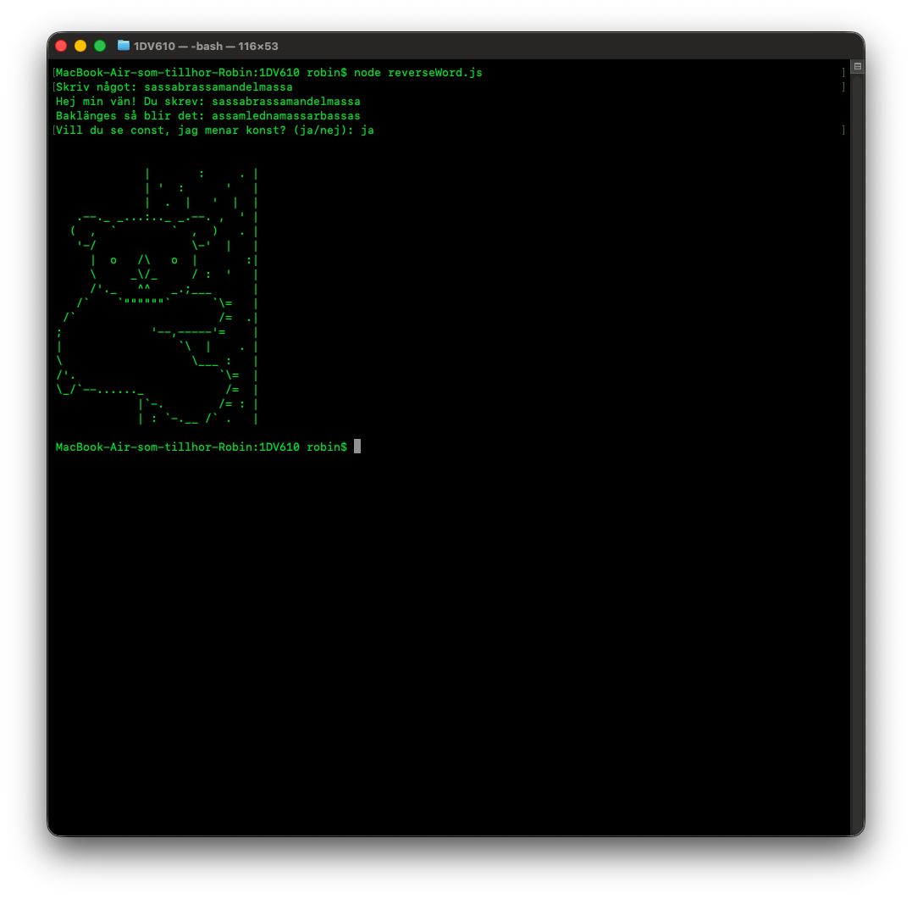

# Reflektion: Laboration 1 – Fortsätt programmera

Länk till repo: https://github.com/rosa24-bth/1DV610

## 1. Att fortsätta programmera

_Vilka kunskaper och färdigheter från tidigare kurser bygger du vidare på i den här uppgiften? Vad var mest utmanande? Vad vill du utveckla vidare i din programmering framöver?_

Svar:
Vi har ju pratat en del om kodkvalitet i kurser jag gått tidigare, även om det kanske inte varit så här renodlat fokus på det som det verkar vara här. Men det mest utmanande är väl bara att komma igång igen helt enkelt. Överlag så var instruktionerna för alla miljöer, VPN m.m. man behövde fixa med tydliga, så det har gått ganska smidigt.

Eftersom det verkar vara något som kan ge verkligt mervärde när man arbetar i samma kod som team så ser jag fram emot att lära mig mer om det här.

## 2. Arbetsflödet

_Hur kändes det att arbeta med Git och använda kursens plattformar?_

Svar:
Det känns helt OK. Så länge det är basic saker man gör i Git så känns det hyfsat hemvant för mig. Men jag tycker också det snabbt känns som djupt vatten med Git så fort något blivit knas eller man ska testa nya kommandon man inte använt innan.

_Varför valde du GitLab eller GitHub för din kod? Vad vägde du in — till exempel integritet, att bygga en publik portfolio, eller vana? Om GitHub — länk till ditt repo:_

Svar:
Länk till repo: https://github.com/rosa24-bth/1DV610

Jag valde GitHub, egentligen mest av vana. Jag har aldrig använt GitLab tidigare. Inte för att det verkar vara mycket svårare egentligen, men kändes smidigt att köra i GitHub.

## 3. Bedömning och att dela publikt

_Uppgiften bedöms inte på kodens stil eller kvalitet, bara på en komplett inlämning. Påverkade det hur du arbetade? Och hur kändes det att posta din skärmdump/video publikt i Zulip, utan möjlighet att göra det privat?_

Svar:
Det känns ju rätt skönt att det inte var så noga hur "bra" man byggde, utan mest att få ihop något. Och det känns helt OK att posta för andra i Zulip. Det värsta som kan hända vore ju att man missförstått uppgiften kanske, och det är ju något som händer alla någon gång och skulle jag missförstå så är det inte omöjligt att fler gjorde det, så det är inget jag är alltför nojig över.

Ett problem jag stötte på dock var när jag skulle ladda upp videon jag spelat in på när jag körde i terminalen, det gick inte. Men skärmdump funkade att ladda upp.

## 4. Ditt program

_Vilket programmeringsspråk valde du, och varför just det?_

Svar:
Jag valde JavaScript eftersom det är något jag använt i tidigare kurser och kändes smidigt helt enkelt.

_Vad gjorde du för att göra välkomstmeddelandet till något mer än bara `"Hej " + namn`?_

Svar:
Jag valde att skriva ut det användaren matat in baklänges, utöver att hälsa. Sen efter det får användaren en fråga om den vill se konst, och får svara på den. Om man svarar ja så visas det ASCII-art av en koala. Så inte särskilt komplext men ändå något mer kul än att bara säga hej + namn.

## 5. AI-samarbete

_Samarbetade du med någon AI-assistent (t.ex. ChatGPT, GitHub Copilot, Claude) — som en kollega snarare än bara ett verktyg? Beskriv kort hur, och ge gärna ett exempel på en prompt som gav ett bra resultat._

Svar:
Nej, jag skapade visserligen inte ASCII-arten själv så klart, utan den googlade jag fram från någon sida som har massa sådana bilder på djur samlade. Sen testade jag att få fram AI-förslag till mina committmeddelanden här i VSC, men just för de här basic sakerna jag gjort så valde jag ändå att skriva egna korta meddelanden. Men det är säkert en del jag kommer ta AI till hjälp framöver kan jag tänka mig, just kopplat till git.

Sen så märkte jag att sådan här auto complete fanns aktiverat men det har jag valt att stänga av.

## 6. Bild eller video

_Bifoga (eller länka till) samma skärmdump/video som du postat i Zulip._

Svar:

